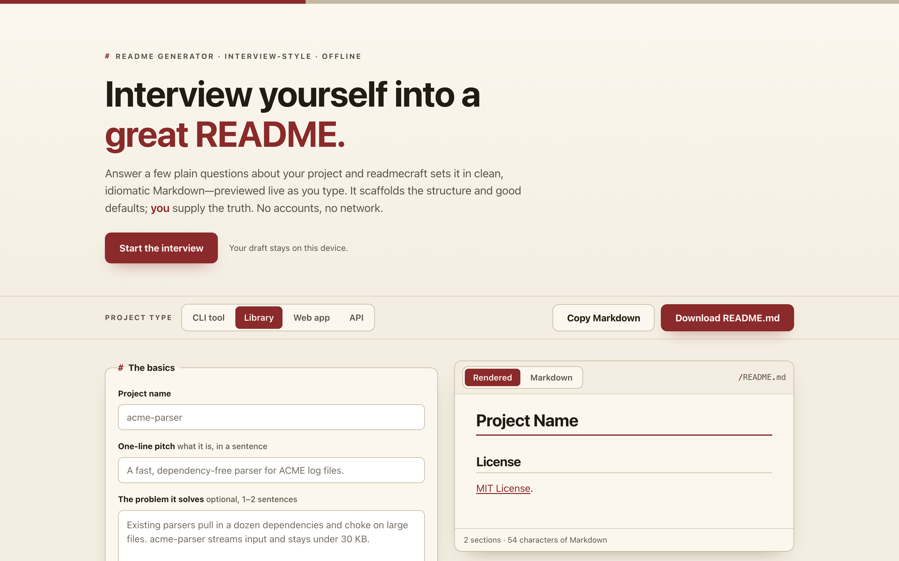

# readmecraft

**Interview yourself into a great README.** Answer a few plain questions about your project and readmecraft sets it in clean, idiomatic Markdown — previewed live as you type. 100% client-side, zero dependencies, works fully offline.

## Why

A good README is mostly structure: a clear title and one-line pitch, why the project exists, how to install and use it, and the license. Most people know their project cold but stall on *what goes where* — so they either skip the README or copy a bloated template full of sections they don't need.

readmecraft turns that into a short interview. You answer questions; it lays out the sections in the right order with idiomatic Markdown (a blockquote pitch, fenced code blocks for install and usage, tidy feature lists, a linked license). You get a real `README.md` you can drop straight into a repo — and because it renders live, you can see exactly what GitHub will show before you commit.

## Features

- **Interview, not a blank page** — structured fields for name, pitch, the problem it solves, install/usage, features, config, contributing, acknowledgements, and license.
- **Project-type presets** — *CLI tool*, *Library*, *Web app*, and *API* pre-shape which sections are on and prime the usage fence with a sensible language. Presets never overwrite text you've already typed.
- **Live Markdown preview** — a hand-rolled renderer (no library) shows the rendered README, or flip to a syntax-highlighted Markdown source view. Either way the export is real Markdown.
- **Toggle & reorder** — switch any optional section off, or reorder the core body with up/down controls. Title and License stay pinned.
- **Copy or download** — copy the Markdown to your clipboard, or download a real `README.md` via a `data:` URL. No network, no build step.
- **Autosaved locally** — your draft persists in your browser's local storage between visits.

## Quickstart

Just open `index.html` in any modern browser — no build step, no server, no install.

- **Local:** double-click `index.html`, or run a static server in the folder.
- **Hosted:** **[Open readmecraft live](https://sreenivas-sadhu-prabhakara.github.io/readmecraft/)**

Pick a project type, work down the interview, and watch the preview fill in. When you're happy, **Copy Markdown** or **Download README.md**.

## Privacy

readmecraft is built to be trustworthy by construction — your unreleased project details never leave your machine.

- A strict Content-Security-Policy sets `connect-src 'none'`: the app **cannot** make any network request even if it tried.
- No external fonts, scripts, images, or analytics. Everything is self-contained; the Markdown renderer and syntax highlighter are hand-written, not libraries.
- Your draft is saved only in your browser's local storage, on your own device. There are no accounts and nothing is uploaded.

## Disclaimer

readmecraft scaffolds structure and sensible defaults from **your** answers — it does not invent, verify, or test anything about your project. It cannot know whether your install command works, whether a feature exists, or whether your license choice is appropriate; it only formats what you type. **Always read the generated README before you publish it.** This software is provided under the MIT License, "as is", without warranty of any kind; the authors accept no liability for any loss or damage arising from its use.

## License

[MIT](./LICENSE) © 2026 Sreenivas Sadhu Prabhakara
